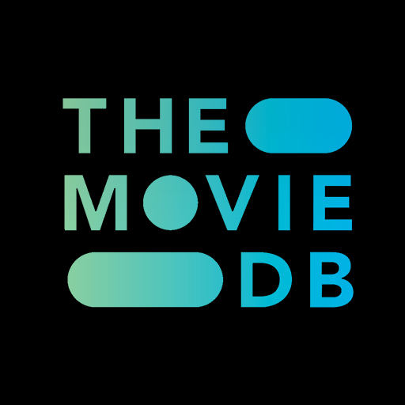

# TV Shows Analysis, Searcher & Much More!

This project is an interactive application that allows users to explore a variety of TV shows, make predictions about their chances of winning an Emmy, and much more...

## 1. Data Collection via API

  

The first step was **collecting data** using **APIs**. I gathered information about TV shows from all over the world, including:
- **Title**
- **Genre**
- **Release Date**
- **Rating**
- **Number of Seasons, Number of Episodes, Episodes Duration**
- **Platforms**
- **Cast**
- **Reviews**

The data was collected from multiple sources (TMDB API and some datasets from Kaggle) to ensure a rich dataset that covers a broad range of shows, including historical data and information on the most recent nominees.

## 2. Exploratory Data Analysis (EDA)

Once the data was collected, I performed **Exploratory Data Analysis (EDA)** to better understand the relationships between different features in the dataset. This process included:
- **Data Cleaning**: Handling missing or inconsistent values, outliers, dropping columns, and replacing values.
- **Feature Engineering**: Grouping variables, such as genre and platforms.
- **Visualizations**: Using **Tableau** to generate insightful and interactive graphs, including:
  - Distribution of series over the years
  - Relation between genre and country
  - Platforms with the most series
  - Most recurrent actors, etc.

## 3. Machine Learning Models

  

After preparing the data, I applied several **Machine Learning Models** to predict the winners of the **Emmy Awards**. 
The models used were:

- **Logistic Regression**
- **K-Nearest Neighbors (KNN)**
- **Decision Trees**
- **Random Forest**

## 4. Sentiment Analysis

  

Another part of this analysis involved diving into **public opinion** through **sentiment analysis**. I conducted sentiment analysis on reviews to evaluate how each TV show was perceived by its audience. The goal was to assess the overall sentiment—whether it was **positive**, **negative**, or **neutral**—and understand how viewers rated each show.

To achieve this, I used **tokenization** and **lemmatization** techniques to process the reviews and extract meaningful insights from the text. Additionally, I employed the **compound score** from the VADER sentiment analysis tool, which helped quantify the overall sentiment in a more comprehensive way. 

To further enhance the analysis, I generated a **WordCloud** that visually represents the most frequently occurring words in the reviews.

